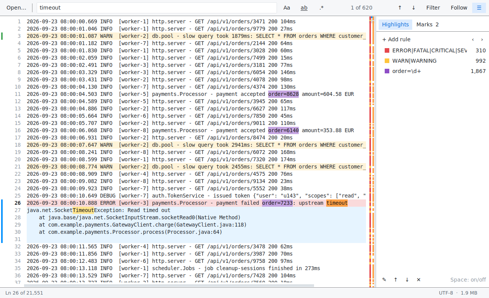
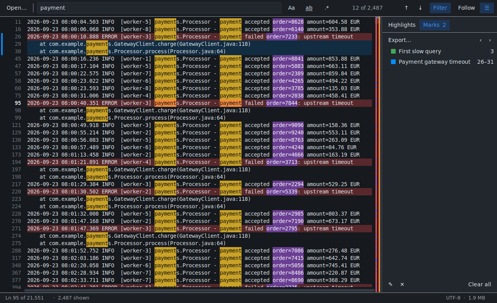

# 📊 JMLogViewer

[](https://github.com/juanmanueldomt/log-viewer/actions/workflows/ci.yml)


**JMLogViewer** es un visor de logs de escritorio, rápido y minimalista, pensado para
depurar archivos de texto muy grandes. Abre archivos de varios GB al instante, busca,
resalta expresiones, marca las secciones importantes y sigue el archivo en vivo
(como `tail -f`). No tiene dependencias: solo Python y Tkinter.



## 🚀 Características

- **Archivos de cualquier tamaño.** El archivo se indexa en segundo plano y solo se
  dibujan las líneas visibles: las primeras líneas aparecen al instante y la memoria
  no depende del tamaño del texto.
- **Búsqueda incremental.** Texto o expresión regular, distinguir mayúsculas y palabra
  completa. Salta al primer resultado mientras escribes, muestra «12 of 2,487» y navega
  con <kbd>Enter</kbd> / <kbd>Shift</kbd>+<kbd>Enter</kbd>.
- **Filtro.** Muestra solo las líneas que coinciden con la búsqueda (como `grep`) sin
  perder la línea en la que estabas: al quitar el filtro vuelves a su contexto.
- **Reglas de resaltado.** Colorea la línea completa o solo el texto que coincide, u
  oculta líneas (por ejemplo, ruido como health checks). Cada regla muestra cuántas
  líneas coinciden y permite saltar entre ellas. Por defecto se resaltan `ERROR` y `WARN`.
- **Marcas.** Haz clic en el número de una línea para marcarla y <kbd>Shift</kbd>+clic
  en otra para convertir la marca en una sección. Las marcas llevan etiqueta y color, se
  recorren con <kbd>F2</kbd>, se recuerdan por archivo y se exportan a un informe Markdown.
- **Seguir (tail).** Muestra las líneas nuevas en cuanto se escriben. Si subes para leer,
  la vista se queda quieta; <kbd>Fin</kbd> la vuelve a pegar al final. Detecta archivos
  truncados o rotados y los recarga.
- **Mapa del archivo.** La barra de desplazamiento indica dónde están las coincidencias de
  cada regla, las marcas y los resultados de búsqueda en todo el archivo.
- **Cómodo.** Tema claro u oscuro, ajuste de línea, zoom, archivos recientes, menú
  contextual («Highlight», «Hide Lines with…», «Show Only Lines with…»), secuencias de color ANSI
  eliminadas y atajos de teclado para todo (<kbd>F1</kbd>).



## 📋 Requisitos

- **Python 3.11 o superior** con **Tkinter**. Los instaladores de python.org para Windows
  y macOS ya lo incluyen; en Debian/Ubuntu instálalo con `sudo apt install python3-tk`.

## 🛠️ Instalación y uso

Sin instalar nada, desde una copia del repositorio:

```bash
git clone https://github.com/juanmanueldomt/log-viewer.git
cd log-viewer
python main.py                        # o: python main.py /var/log/app.log
```

O instalado como aplicación (crea el comando `jmlogviewer`):

```bash
python -m pip install .
jmlogviewer /var/log/app.log --follow
```

| Opción | Descripción |
| --- | --- |
| `ARCHIVO` | Log que se abre al iniciar. |
| `-f`, `--follow` | Seguir el archivo mientras crece (como `tail -f`). |
| `-n N`, `--line N` | Empezar en la línea `N`. |
| `--debug` | Escribir diagnósticos en la consola. |
| `--version` | Mostrar la versión. |

## ⌨️ Atajos de teclado

En macOS usa <kbd>Cmd</kbd> en lugar de <kbd>Ctrl</kbd>. La lista completa está en
**Help → Keyboard Shortcuts** (<kbd>F1</kbd>).

| Atajo | Acción |
| --- | --- |
| <kbd>Ctrl</kbd>+<kbd>O</kbd> | Abrir un archivo |
| <kbd>Ctrl</kbd>+<kbd>F</kbd> o <kbd>/</kbd> | Buscar |
| <kbd>Enter</kbd>, <kbd>F3</kbd> o <kbd>n</kbd> / <kbd>Shift</kbd>+… o <kbd>N</kbd> | Resultado siguiente / anterior |
| <kbd>Ctrl</kbd>+<kbd>Shift</kbd>+<kbd>F</kbd> | Mostrar solo las líneas que coinciden |
| <kbd>Alt</kbd>+<kbd>C</kbd> / <kbd>W</kbd> / <kbd>R</kbd> | Mayúsculas / palabra completa / regex |
| <kbd>Ctrl</kbd>+<kbd>M</kbd> o <kbd>m</kbd> | Marcar la línea o las líneas seleccionadas |
| <kbd>F2</kbd> / <kbd>Shift</kbd>+<kbd>F2</kbd> | Marca siguiente / anterior |
| <kbd>Ctrl</kbd>+<kbd>T</kbd> | Seguir el archivo (tail) |
| <kbd>Ctrl</kbd>+<kbd>G</kbd> | Ir a la línea |
| <kbd>Ctrl</kbd>+<kbd>B</kbd> | Mostrar u ocultar el panel lateral |
| <kbd>Alt</kbd>+<kbd>Z</kbd> | Ajuste de línea |
| <kbd>Ctrl</kbd>+<kbd>+</kbd> / <kbd>-</kbd> / <kbd>0</kbd> | Zoom |

## ⚡ Rendimiento

Medido con un log de 200 MB y 1,8 millones de líneas:

| Operación | Tiempo |
| --- | --- |
| Primeras líneas en pantalla | 0,2 s |
| Indexado completo | 0,4 s |
| Búsqueda en todo el archivo | ~1 s |
| Dibujar una pantalla al desplazarse | 1–2 ms |
| Memoria del proceso | ~60 MB |

La interfaz sigue respondiendo mientras se indexa y se busca: el trabajo pesado se hace
en segundo plano, por partes y por orden de prioridad (cargar > buscar > contar reglas).

## 💾 Dónde se guardan los ajustes

Reglas, preferencias, archivos recientes y las marcas de cada archivo se guardan en
JSON en `~/.config/jmlogviewer` (Linux), `~/Library/Application Support/JMLogViewer`
(macOS) o `%APPDATA%\JMLogViewer` (Windows). La variable de entorno
`JMLOGVIEWER_CONFIG_DIR` permite usar otra carpeta (por ejemplo, para una versión portátil).

## 🧑‍💻 Desarrollo

```bash
python -m venv .venv
source .venv/bin/activate            # Windows: .venv\Scripts\activate
python -m pip install --upgrade pip  # --group necesita pip 25.1 o superior
python -m pip install --group dev -e .

ruff check . && ruff format --check .
mypy
pytest                               # en Linux sin pantalla: xvfb-run -a pytest
```

La integración continua ejecuta lo mismo en Linux, Windows y macOS con Python 3.11–3.13.

### Estructura

```text
src/jmlogviewer/
├── core/          # sin Tkinter: se prueba de forma aislada
│   ├── logfile.py     índice de líneas, lectura por bloques y detección de cambios (tail)
│   ├── scanner.py     búsqueda línea a línea sobre bloques grandes de texto
│   ├── session.py     estado del log abierto: búsqueda, filtros, reglas y marcas
│   ├── tasks.py       planificador de trabajo en segundo plano por prioridades
│   └── …              consultas, reglas, marcas, ajustes, exportación
└── ui/            # Tkinter
    ├── logview.py     vista virtualizada: solo dibuja las líneas visibles
    ├── main_window.py ventana principal, menús y atajos
    └── …              barra de búsqueda, panel lateral, diálogos y temas
```

### Crear un ejecutable

```bash
python -m pip install pyinstaller
pyinstaller --name JMLogViewer --windowed --paths src main.py
```

## 📄 Licencia

[GNU Affero General Public License v3.0](LICENSE).
